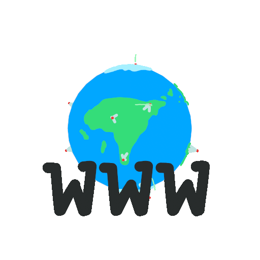

## Nombre de Visiteurs sur mon profil 

# Bienvenue, je m'appelle Kévyn (DevAKev pour les intimes) ! 👋

## Qui suis-je ?
Je suis un  qui aime l'innovation et les technologies qui façonnent l'avenir. J'ai une passion dévorante pour la programmation et la création de contenus visuels. 

## Technologies & Langages
 

## Mes réalisations

## Collaborons !
Ouvert à toute proposition de collaboration, je suis prêt à apporter ma créativité à vos projets. [Contactez-moi](https://devakev.github.io/aiche-kevyn)!

## Portfolio
### [Voir le portfolio](https://devakev.github.io/aiche-kevyn) 🚀
